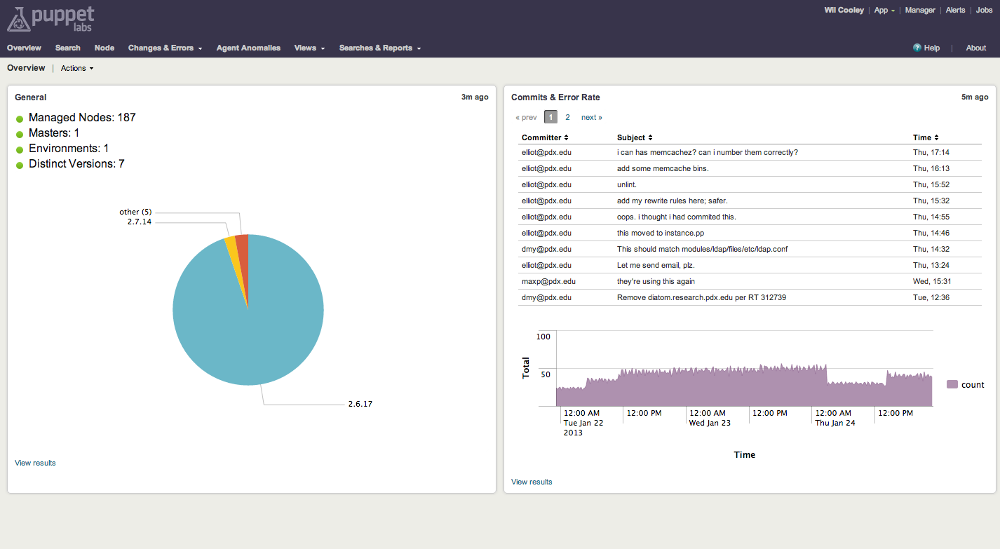
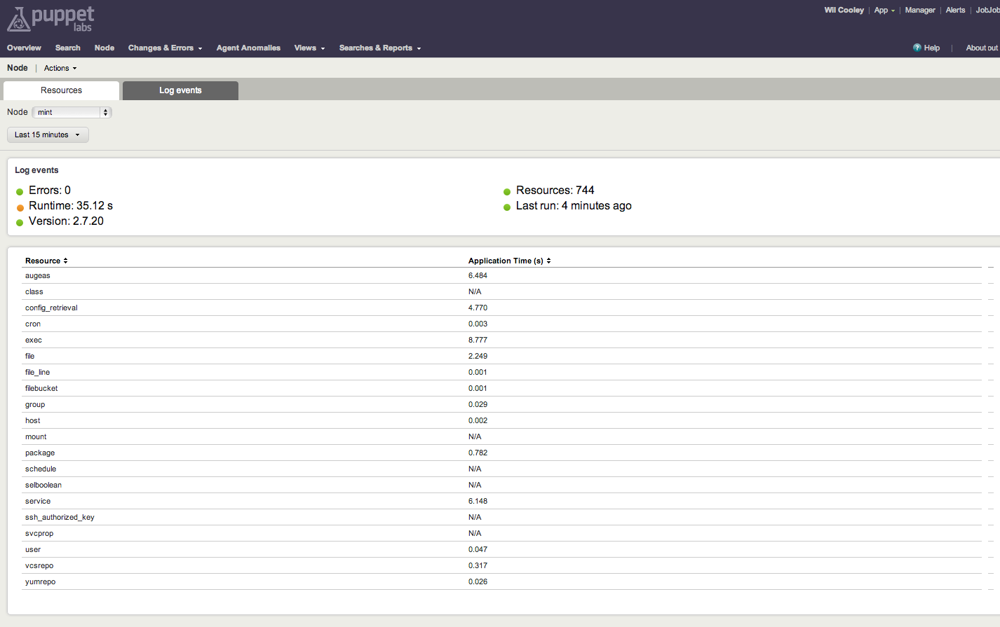
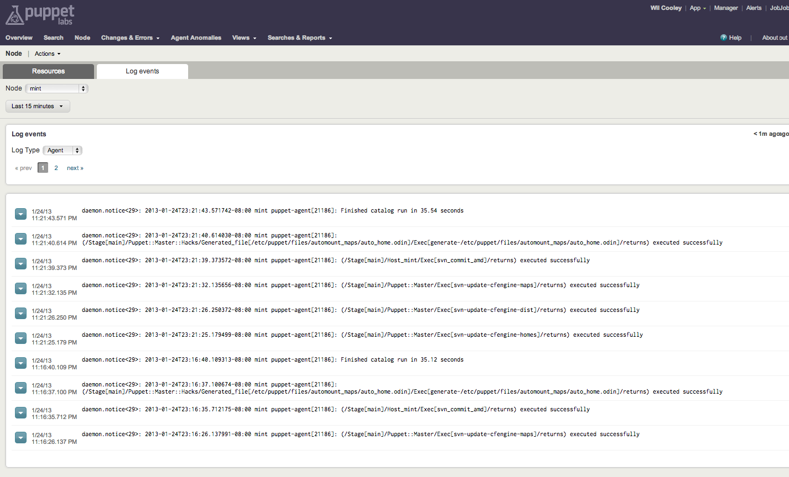
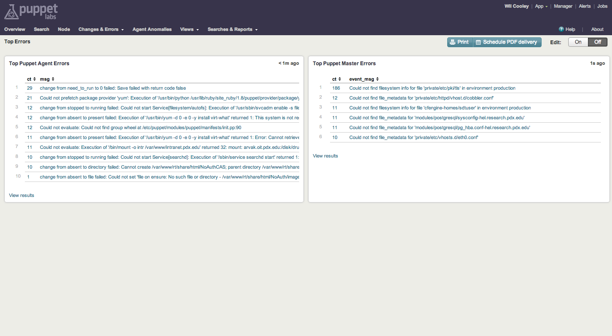
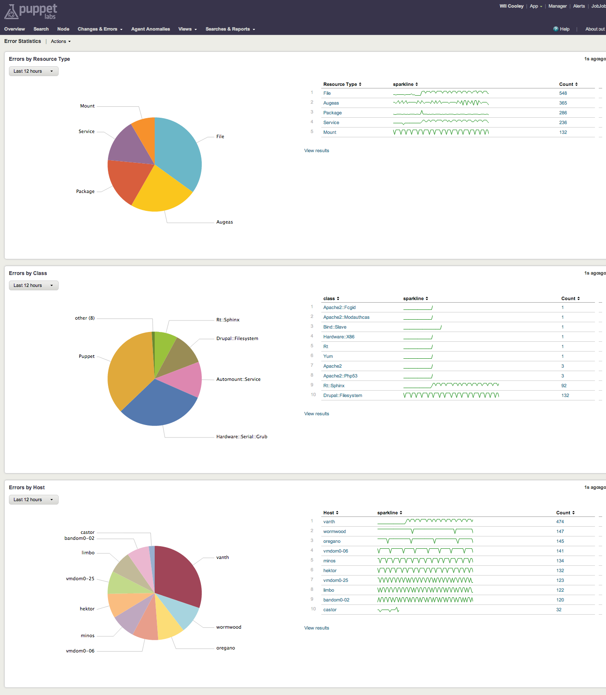
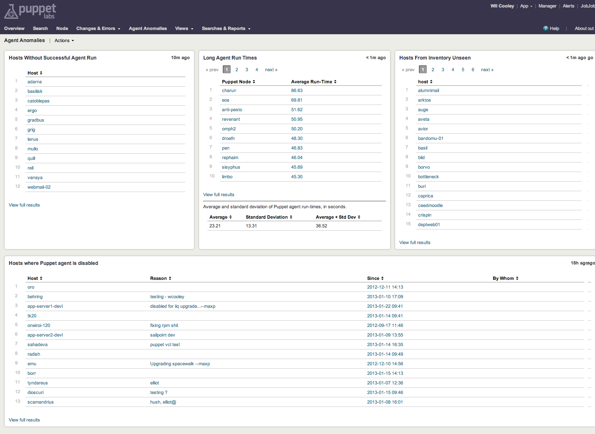
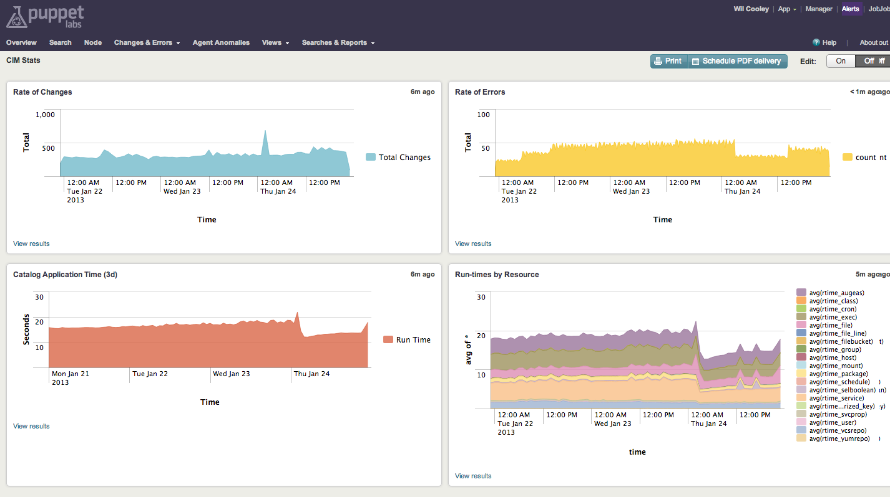
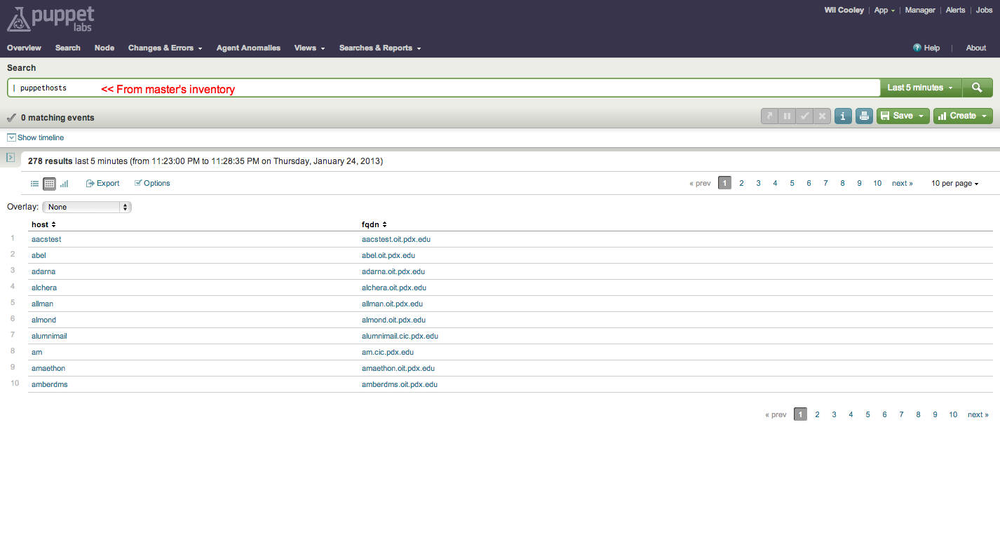

## Screenhosts

See Puppet Pulse in action!

### Overview

### Node View
#### Resources

#### Events

### Changes vs Errors

### Top Errors

### Error statistics

### Agent Anomalies

### CIM Stats (from [cimlog report](https://github.com/wcooley/puppet-cimlog))

### Custom Search Command "puppethosts"

### Scheduled search inputlookup

